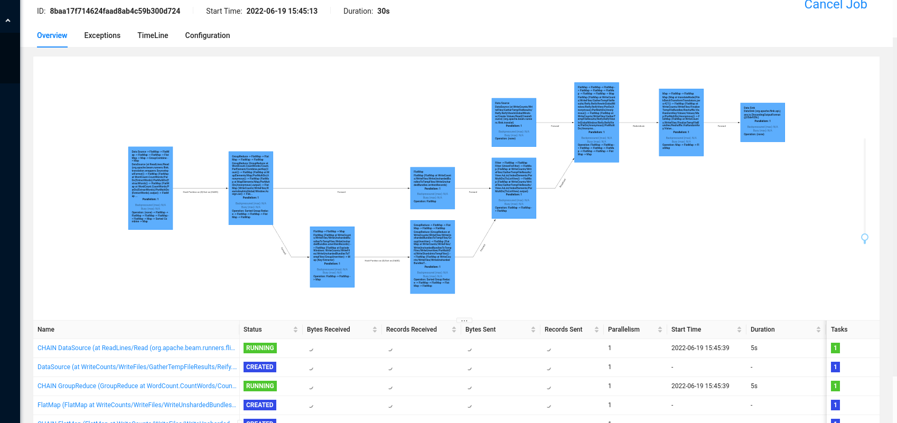

# Migrate Dataflow to EKS/GCP/AWS (aka Deploy Flink server with auto-scale capabilities)

The project aim is to deploy Flink Server and submit batch job to Flink server instead of Dataflow server.

I don't find any comprehensive tutorial thus I write one.

## Deploy native Flink server with auto-scale enabled on Minikube
1. Enable the default service account to watch, create, delete pod `kubectl apply -f yaml/minikube-native-flink/access.yaml`
2. Bind the role to default service account 
```shell
kubectl create clusterrolebinding flink-role-pod \
--clusterrole=flink-role  \
--serviceaccount=default:default
```
3. Download Flink 1.14 https://flink.apache.org/downloads.html#apache-flink-1150 
4. Extract and cd into Flink folder
5. `./bin/kubernetes-session.sh -Dkubernetes.cluster-id=my-first-flink-cluster`
6. Proxy the Web interface by `kubectl port-forward service/my-first-flink-cluster-rest 8081:8081`
7. Open http://localhost:8081 to view the Native Flink service

## Deploy Apache Beam Hello world
1. Clone Apache word count project
```shell
mvn archetype:generate \
    -DarchetypeGroupId=org.apache.beam \
    -DarchetypeArtifactId=beam-sdks-java-maven-archetypes-examples \
    -DarchetypeVersion=2.39.0 \
    -DgroupId=org.example \
    -DartifactId=word-count-beam \
    -Dversion="0.1" \
    -Dpackage=org.apache.beam.examples \
    -DinteractiveMode=false && cd word-count-beam
```
2. Submit to Flink job
```shell
mvn package exec:java -Dexec.mainClass=org.apache.beam.examples.WordCount \
    -Dexec.args="--runner=FlinkRunner --flinkMaster=localhost:8081 --filesToStage=target/word-count-beam-bundled-0.1.jar \
                 --inputFile=gs://apache-beam-samples/shakespeare/* --output=/tmp/counts" -Pflink-runner
```
3. To Flink server http://localhost:8081, see result


## References
- https://nightlies.apache.org/flink/flink-docs-release-1.15/docs/deployment/resource-providers/native_kubernetes/
- https://nightlies.apache.org/flink/flink-docs-release-1.8/ops/deployment/kubernetes.html